# Project HomeLab - AI-Ops Laboratory Infrastructure

This repository documents my learning and development process of a security-focused HomeLab 
utilizing Proxmox VE, pfSense Firewall, network segmentation, and virtualization.

The objective is to gain hands-on experience for a career as a System Administrator with a focus 
on Networking and IT Security.

---

## Table of Contents

- [Project Objectives](#project-objectives)
- [Hardware & Initial Setup](#hardware--initial-setup)
- [Architecture Overview](#architecture-overview)
- [Network Design](#network-design)
- [Proxmox Installation](#proxmox-installation)
- [pfSense Firewall](#pfsense-firewall)
- [Virtual Machines](#virtual-machines)
- [Testing & Validation](#testing--validation)
- [Security Measures](#security-measures)
- [Current Status](#current-status)
- [Roadmap / Next Steps](#roadmap--next-steps)

---

## Project Objectives

- Build a Proxmox HomeLab on Bare Metal.
- Implement pfSense as the central Firewall & Router.
- Network isolation using VLANs & Subnets.
- Implementation of a DMZ for public-facing services.
- Operation of Linux and Windows VMs.
- Systematic documentation of the learning process.

---

## Hardware & Initial Setup

| Component | Description |
|-----------|-------------|
| Server    | AOOSTAR WTR PRO – AMD Ryzen 7 5825U, 64 GB RAM |
| Router    | TP-Link Archer AX18 |
| ISP       | Magenta Gateway |
| Client    | Linux Mint / Laptop |

---

## Network Documentation (As of Feb 10, 2026)

This project includes the setup of an isolated laboratory environment (VLAN 30) behind a pfSense firewall on a Proxmox host.

### Core Components
* **VM Name:** `ai-ops-01`
* **OS:** Ubuntu Server
* **IP Address:** `192.168.30.20`
* **VLAN ID:** 30
* **Gateway:** `192.168.30.1` (pfSense)

---

## Troubleshooting Process: Path to Connectivity

To establish internet connectivity for the VM in VLAN 30, the following potential issues were systematically excluded using the OSI Model approach:

### 1. Layer 2: Physical & Logical Connection (Proxmox/VLAN)
* **Issue:** The VM could not reach the gateway.
* **Solution:** Ensured the Proxmox bridge (`vmbr1`) is "VLAN-aware" and the VM is assigned the correct VLAN tag (30).
* **Validation:** `ip neigh` showed the status `REACHABLE` for the gateway's MAC address.

### 2. Layer 3: Routing & Firewall (pfSense)
* **Issue:** Packets were blocked by pfSense (`Default deny rule`).
* **Solution:** * Created a **Pass Rule** on the `AIOPS` interface.
    * Changed the source from a specific IP to **`Any`** to rule out subnet misconfigurations.
* **Validation:** Successful ping to gateway `192.168.30.1`.

### 4. Layer 4 & NAT: Internet Access (WAN)
* **Issue:** Packets reached pfSense but did not exit correctly to the internet.
* **Solution:**
    * Configured **Outbound NAT** on the `WAN` interface for the `192.168.30.0/24` network.
    * Disabled **Static Port** to ensure compatibility with the upstream primary router.
* **Validation:** `ping -n 1.1.1.1` was successful.

### 5. Application Layer: Name Resolution (DNS)
* **Issue:** Internet access via IP was functional, but `google.com` could not be resolved.
* **Solution:** Added the `192.168.30.0/24` subnet to the **DNS Resolver Access Lists** in pfSense.
* **Validation:** `ping google.com` was successful.

---

## Sensitive Data & Vault
In accordance with the project policy (Jan 28, 2026), all sensitive variables and the final network topology are managed within the `vault_passwords.yml` file.

## 5. System Optimization & Management (As of Feb 11, 2026)

After establishing basic connectivity, the VM was prepared for professional operation within Proxmox and for automation.

### QEMU Guest Agent Integration
To improve communication between the Proxmox host and the VM (e.g., for graceful shutdowns and IP display), the Guest Agent was installed.
* **Command:** `sudo apt install qemu-guest-agent`
* **Status:** Service successfully activated, even though Ubuntu manages it as a static unit.
* **Result:** The VM's IP address is now directly visible in the Proxmox summary.

> 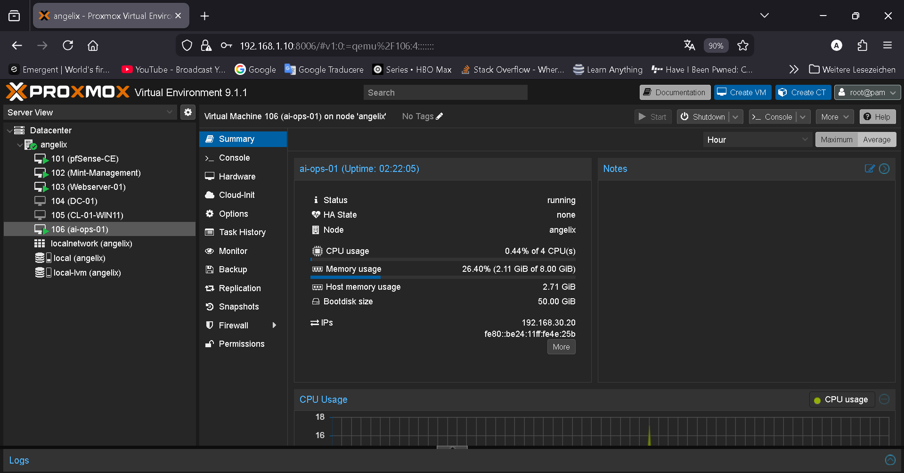

---

### Static Network Configuration (Netplan)
To ensure the VM remains reachable at a consistent address for automation, it was transitioned from DHCP to a static configuration.
* **File:** `/etc/netplan/50-cloud-init.yaml`
* **Configuration:**
  * IP: `192.168.30.20/24`
  * Gateway: `192.168.30.1`
  * DNS: `192.168.30.1` (pfSense) & `8.8.8.8`

> **Insert Screenshot here:** (Content of Netplan YAML file)
> 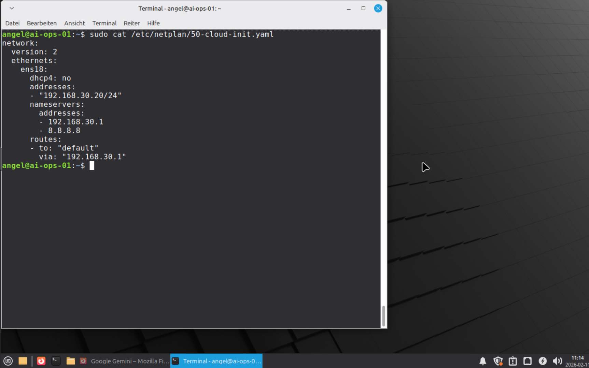

---

## 6. Automation with Ansible & Vault

Laboratory access is now managed centrally from the Management PC (Linux Mint) via Ansible.

### Security Infrastructure (SSH & Vault)
* **SSH Keys:** The public key from the Management PC was deployed (`ssh-copy-id`) to enable passwordless logins.
* **Ansible Vault:** Sensitive data, such as the `sudo` password for user `angel`, is stored encrypted in `group_vars/all.yml`.
* **Vault Automation:** Optimized the workflow using a local `.vault_pass.txt` and `ansible.cfg` to eliminate manual password prompts during playbook execution.

> **Insert Screenshot here:** (Successful Ansible Ping or `whoami` test run)
> 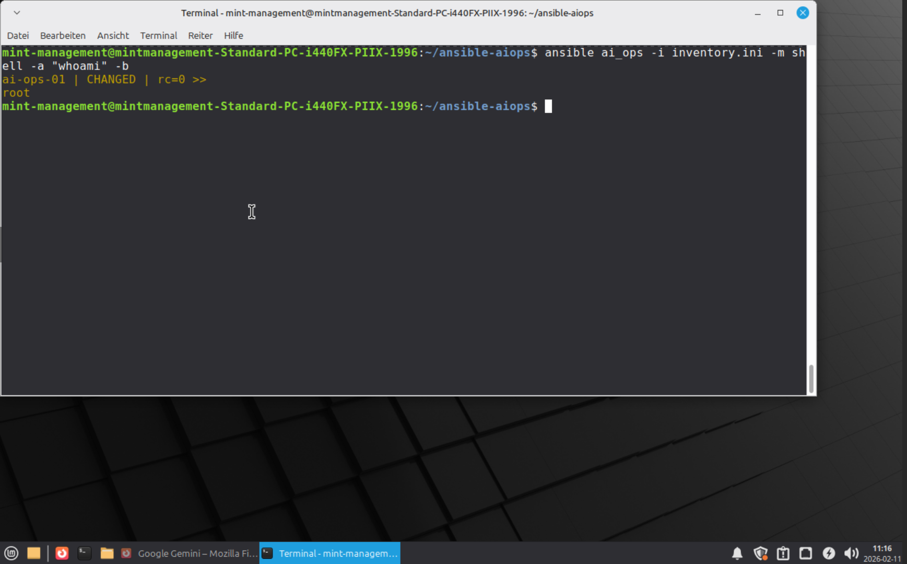

### Automated Maintenance Playbooks
Implemented workflows:
1. **`update_system.yml`**: Performs a full `apt upgrade`.
2. **`check_reboot.yml`**: Checks for the existence of `/var/run/reboot-required` and securely reboots the VM if necessary.

> **Insert Screenshot here:** (Ansible Playbook Run without errors)
> 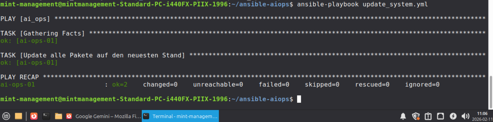

---

## Current Project Status (Milestone 1 reached)
- [x] Isolated network environment (VLAN 30) active.
- [x] Internet access & DNS via pfSense stable.
- [x] VM management via Proxmox Guest Agent active.
- [x] Full control established via Ansible automation.

## 7. Infrastructure & Container Automation (As of Feb 11, 2026)

Following successful network integration, the VM `ai-ops-01` was fully provisioned as a **Docker Host** via automation.

### Milestone: Infrastructure as Code (IaC)
The entire setup process is managed via Ansible, including:
* **System Maintenance:** Intelligent reboot checks (`check_reboot.yml`).
* **Docker Stack:** Automated installation of Docker Engine & Docker Compose (`setup_docker.yml`).
* **Security:** Secure management of database passwords and API keys using **Ansible Vault**.

> **Proof 1: Intelligent System Maintenance**
> Ansible independently detects if a reboot is required and skips the task (`skipping`) if the system is up to date.
> 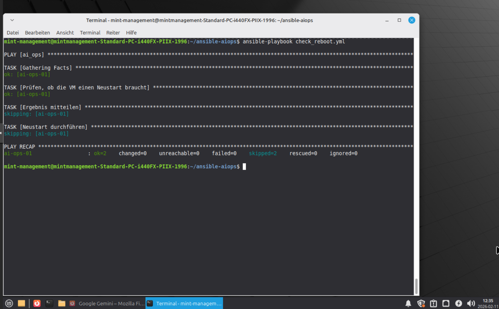

---

### Milestone: Container Host Ready
The VM is now ready for the deployment of n8n and AI tools. The user `angel` has been authorized to manage Docker containers without `sudo`, improving security and workflow.

> **Proof 2: Successful Docker Provisioning**
> The final playbook report shows the successful setup of all components and user permissions.
> 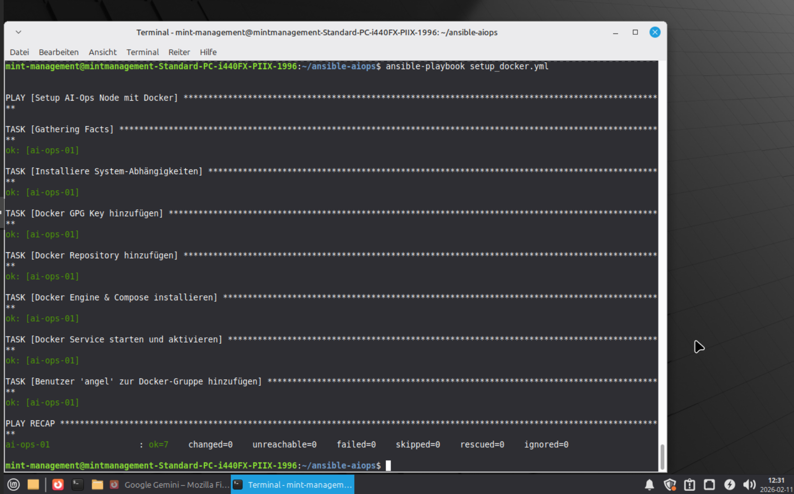

---

## Current Project Status
- [x] Static IP & Guest Agent configured.
- [x] Ansible Vault & SSH Key authentication active.
- [x] Docker & Docker Compose fully operational.
- [ ] **Next Step:** Start the n8n stack (n8n + Postgres).

## 9. Deployment of the AI Workflow System (n8n)

The heart of the automation, **n8n**, was deployed as a container stack alongside a **Postgres** database.

### Stack Details:
* **Orchestration:** Docker Compose (via Ansible `community.docker` collection).
* **Persistence:** Docker Volumes for n8n data and database content.
* **Security:** Dynamic injection of DB credentials via Ansible Vault during deployment.

> **Proof: Successful Stack Deployment**
> All tasks were executed without errors; the stack is production-ready.
> 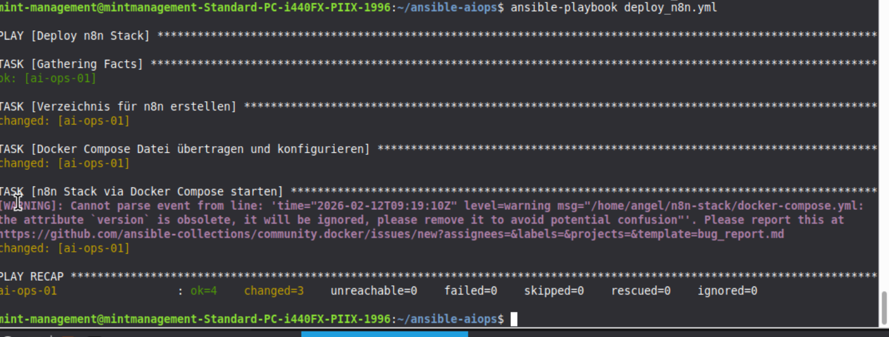

### 9.1 Troubleshooting & Configuration Adjustments
During deployment, specific adjustments were made to make the stack operational in a local development environment:

* **YAML Validation:** Corrected indentation in the Docker Compose template to resolve the `additional properties not allowed` error.
* **Security Override:** Set `N8N_SECURE_COOKIE=false` to allow local HTTP access without SSL.
* **Vault Integration:** Used `vault_passwords.yml` for secure injection of the `POSTGRES_PASSWORD` variable.

### 9.2 Operational Verification
After deployment, system reachability was successfully verified.

| Component | Status | URL / Port |
| :--- | :--- | :--- |
| **n8n Frontend** | ✅ Online | `http://192.168.30.20:5678` |
| **Postgres DB** | ✅ Connected | Internal Port 5432 |

---

## 10. Integration of Local LLMs (Ollama & Llama3)

To ensure privacy-compliant and cost-free AI processing, the system was expanded with a local LLM interface.

### 10.1 Automated Ollama Installation
Installed via a dedicated Ansible playbook (`install_ollama.yml`), handling:
* Download and installation of the Ollama binary.
* Systemd service configuration for auto-start.
* Initial pull of the **Llama3** model (approx. 4.7 GB).

### 10.2 n8n AI Agent Configuration
An intelligent workflow was created in n8n, acting as the bridge between the automation server and the local AI.

**Configuration Details:**
* **Node Structure:** An `AI Agent` acts as the brain, supported by an `Ollama Chat Model`.
* **Connectivity:** Connected via VM IP on port `11434`.
* **Model:** Utilizing `llama3:latest`.

> **Proof: Successful AI Execution**
> The image shows the validated workflow. The green indicators confirm that the AI Agent successfully communicated with Llama3 and generated a response.
> 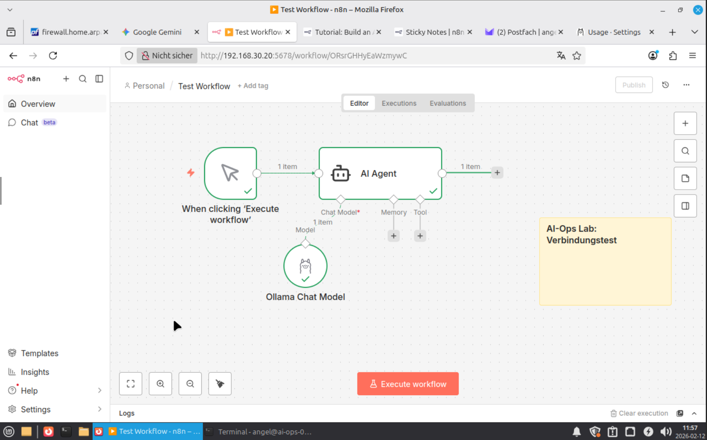

---

## 11. Modernizing the AI Control Plane: Open WebUI & MCP 

Following extensive testing, the architecture migrated from OpenClaw to **Open WebUI** for robust **Model Context Protocol (MCP)** integration and stable connection to local inference engines.

### 11.1 Decentralized Architecture ("The Control Plane")
Roles are distributed to optimize resources and isolate the management layer:
* **Management Hub (VM 102 - Mint):** Hosts the frontend (**Open WebUI**) and automation engine (**n8n**).
* **AI Service Node (ai-ops-01):** Hosts the inference engine (**Ollama**) and interface logic (**MCP Server & mcpo Bridge**).

### 11.2 Model Context Protocol (MCP) & Bridge Technology
Implemented a `FastMCP`-based server to grant the AI direct access to Proxmox infrastructure.
* **The Challenge:** Open WebUI requires a standard OpenAPI/REST interface, while MCP communicates natively via SSE (Server-Sent Events).
* **The Solution:** Implementation of the **`mcpo` Bridge**. This runs the MCP Python script as a stdio subprocess and translates tools into a dynamic `openapi.json` on port `5002`.
* **Security Patch:** Implemented a Python monkey-patch to disable `dns_rebinding_protection` in FastMCP, allowing cross-VLAN access from the Management VM to the Docker host.

---

## 12. Final AI-Ops Stack: Status & Validation

Provisioned entirely via Ansible (`deploy_ai_brain.yml`) using encrypted secrets from `vault_passwords.yml`.

### 12.1 Component Matrix
| Service | Port | Host | Role |
| :--- | :--- | :--- | :--- |
| **Open WebUI** | 8080 | Mint-VM (102) | Primary Chat Interface & Tool Hub |
| **n8n** | 5678 | Mint-VM (102) | Event-Handling & Workflow Automation |
| **mcpo (Bridge)** | 5002 | ai-ops-01 | REST Translator for Proxmox Tools |
| **Ollama** | 11434 | ai-ops-01 | Local LLM Inference (Llama3) |
| **Proxmox API** | 8006 | Host (WTR Pro) | Target Infrastructure for AI Control |

### 12.2 Connectivity Validation
Verified via the generated OpenAPI specification:
`curl http://192.168.1.10:5002/openapi.json | python3 -m json.tool`

**Result:** The AI now has "hands" within the HomeLab. It can autonomously:
1. Fetch VM lists from the Proxmox host.
2. Analyze resource utilization (CPU/RAM) across nodes.
3. Start/Stop VMs based on natural language commands.

---

## 13. Advanced Automation: AI-Ops Monitoring

The automation layer has reached full maturity. The system now autonomously monitors the Proxmox infrastructure and reports status changes via Telegram using local AI.

### 13.1 Full-Loop AI-Ops Architecture
The integration was verified by a successful end-to-end execution, transforming raw JSON data into human-readable intelligence.

* **Endpoint:** `http://192.168.30.20:5002/list_vms`
* **Method:** `POST` (Utilizing Raw Body for custom data mapping)
* **AI Engine:** Ollama / Llama3 (Local Inference)
* **Result:** n8n retrieves the VM list, feeds it into the LLM, and delivers a German status report via Telegram.


### 13.2 Technical Deep Dive: The n8n-to-Ollama Fix
During implementation, we identified that n8n’s default JSON serializer has limitations with complex mappings. 

**The Solution:** We switched the HTTP Request to **Body Content Type: Raw** with `application/json` headers. This allowed us to use a JavaScript `.map()` expression to pre-format the VM data for the AI.

**Optimized Prompt Logic:**
```json
{
  "model": "llama3",
  "stream": false,
  "prompt": "Analysiere diese Proxmox VMs auf Deutsch und gib einen kurzen Statusbericht: {{ $input.all().map(i => i.json.node + ' VM ' + i.json.name + ' ist ' + i.json.status).join(', ') }}"
}
```

### 13.3 Notification & Formatting (Telegram)
To ensure professional readability in the Telegram client, a Regex-based string replacement was implemented to handle the AI's newline characters (`\n`).

**Telegram Expression:**
`{{ $json.response.replace(/\\n/g, '\n') }}`

> **Proof: Successful Proxmox Analysis via Telegram**
> The screenshot confirms that Llama3 correctly identifies "stopped" VMs (e.g., `DC-01`, `CL-01-WIN11`) and delivers a structured report to the "Homelab Monitor" bot.
> 

---

## 14. AI-Driven Security: pfSense Log Analysis (Status: 2026-02-25)

After establishing infrastructure monitoring, the system was expanded to include a security-focused workflow that analyzes firewall logs in real-time using Llama3.

### 14.1 Log Collection via Syslog-ng
To make pfSense logs accessible for the AI, a remote logging pipeline was established.

* **Configuration:** pfSense was configured (via WebUI: Status -> System Logs -> Settings) to send logs to the central AI node.
* **Remote Log Server:** `192.168.30.20:5141` (ai-ops-01).
* **Receiver:** A `syslog-ng` Docker container was deployed on `ai-ops-01` to capture and store the incoming stream.

> **Proof: pfSense Remote Logging Configuration**
> 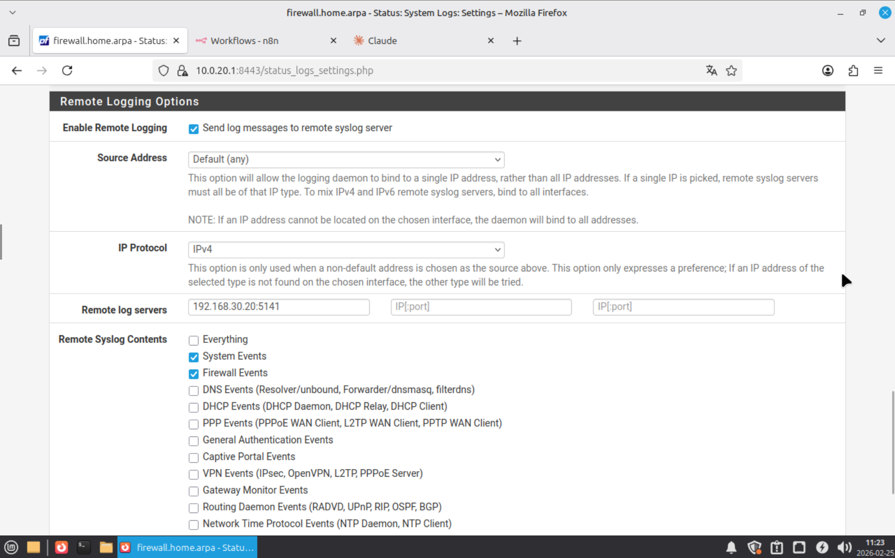

### 14.2 The Security Monitor Workflow
A second n8n workflow was implemented to perform automated threat hunting:

1.  **Read Logs:** n8n accesses the log file `/var/log/syslog-ng/pfsense.log` via the `Execute Command` node.
2.  **AI Filtering:** The logs are forwarded to the local Llama3 instance.
3.  **Prompt Logic:** The AI is tasked to identify suspicious patterns, blocked connection attempts from unusual IPs, or potential security breaches.
4.  **Instant Alerting:** If security concerns are found, a detailed summary is sent via Telegram.

> **Proof: AI Security Analysis in n8n**
> The screenshot shows the successful parsing of firewall logs. Llama3 identifies patterns in the `pfsense.log` and summarizes them for Telegram.
> 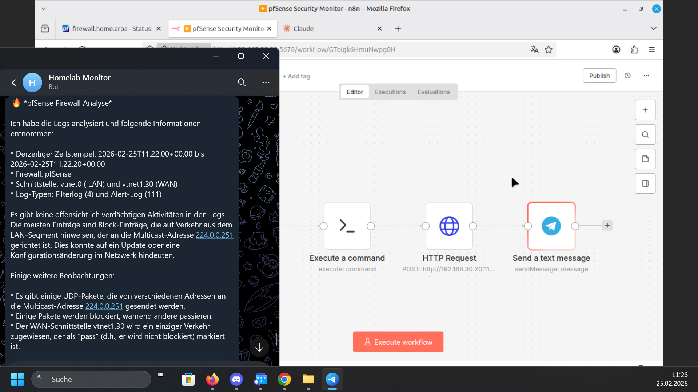

### 14.3 Technical Optimization: Volume Mounting
To ensure n8n can read the logs generated by the `syslog-ng` container, the log directory was mounted as a shared volume across both containers. This ensures zero-latency access to security events.

---

## 15. AI-Ops Stack Overview

The laboratory infrastructure is now fully "AI-Aware" and consists of the following service matrix on **ai-ops-01 (192.168.30.20)**:

| Service | Port | Role |
| :--- | :--- | :--- |
| **n8n** | `5678` | Central Automation Engine & Workflow Orchestrator |
| **Open WebUI** | `8080` | Human-to-AI Interface (Chat) |
| **Ollama** | `11434` | Local LLM Inference (Llama3) |
| **mcpo** | `5002` | REST Bridge for Proxmox API Control |
| **syslog-ng** | `5141` | Central Security Log Collector for pfSense |

---
---

## 16. Infrastructure as Code: The "AI Brain" Playbook

To ensure 100% reproducibility and disaster recovery, the entire AI-Ops stack has been migrated to a centralized Ansible configuration.

### 16.1 Automated Deployment (deploy_ai_brain.yml)
The manual container setups were refactored into an idempotent Ansible playbook. This allows for a one-click redeployment of the complete infrastructure on `ai-ops-01`.

**Key Tasks Automated:**
* **Directory Structure:** Creation of persistent data paths for logs and workflows.
* **Component Deployment:**
    * **Open WebUI:** Central AI interface.
    * **Proxmox MCP & mcpo Bridge:** Infrastructure API connectors.
    * **Syslog-ng:** Centralized log collector for pfSense security audits.
    * **n8n Stack:** The automation engine orchestrating the workflows.
* **Security:** Integrated `ansible-vault` using `vault_passwords.yml` for sensitive credential injection.

> **Proof: Successful Infrastructure Orchestration**
> The terminal output confirms that all 8 tasks executed successfully (ok=8), verifying that the AI-Ops environment is now fully managed via Infrastructure as Code (IaC).
> 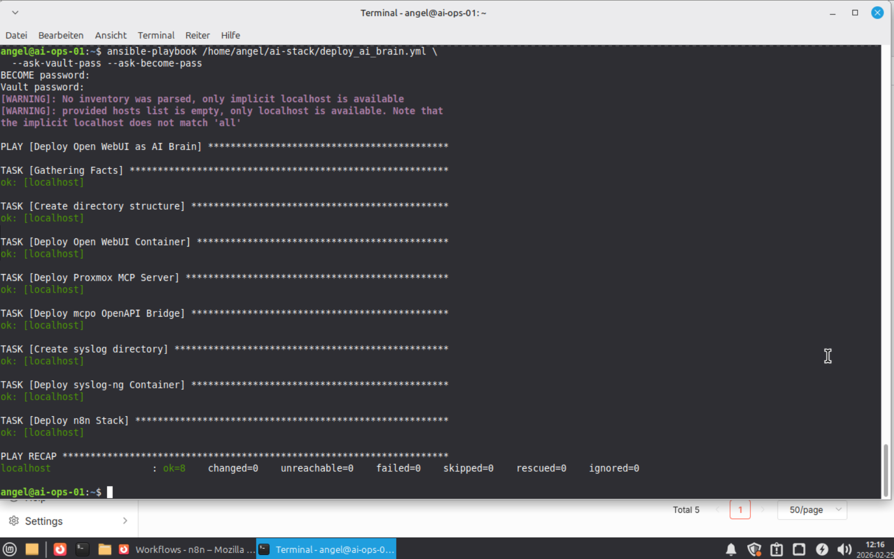

---

## 19. Network Security: Hardening the AI-Ops Node

After the successful deployment via Ansible, the network layer was hardened to prevent unauthorized access to the AI services, as all containers were binding to `0.0.0.0`.

### 19.1 Threat Analysis & Port Mapping
A system audit revealed several exposed services on `ai-ops-01` (`192.168.30.20`):
* **Port 8080:** Open WebUI (Cleartext)
* **Port 5678:** n8n (Cleartext)
* **Port 11434:** Ollama API
* **Port 5141:** Syslog-ng (UDP/TCP)

### 19.2 Zero Trust Firewall Rules (pfSense)
To secure these services, a strict "Default Block" policy was implemented on the pfSense firewall for the AIOPS VLAN.

| Order | Action | Source | Destination | Ports | Description |
| :--- | :--- | :--- | :--- | :--- | :--- |
| 1 | **PASS** | `10.0.10.52` (Mint) | `192.168.30.20` | 5678, 8080 | Mgmt Access |
| 2 | **PASS** | `192.168.30.20` | `Any` | Any | Outbound Updates |
| 3 | **BLOCK**| `Any` | `192.168.30.20` | Any | Security Baseline |


### 19.3 Verification
* **Success:** Access via Management VM (`10.0.10.52`) remains fully functional.
* **Security:** Unauthorized access attempts from other VLANs are successfully dropped by Rule 3.

> **Note:** The order of rules is critical. The "Allow" rule for the Management VM must precede the "Block All" rule to ensure administrative access is not severed.

## 20. Disaster Recovery & Configuration Backup (Status: 2026-02-26)

To protect the "AI-Ops Brain" from hardware failure or data corruption, a multi-tier backup strategy has been implemented, focusing on Version Control (Git) and encrypted off-site storage.

### 20.1 Target Components for Backup
The following critical components are prioritized for the backup routine:
* **Ansible Repository:** All playbooks (`deploy_ai_brain.yml`), roles, and inventory files.
* **n8n Workflows:** Exported JSON files of the Proxmox, pfSense, and Trading pipelines.
* **Configuration Files:** Docker-compose files, `syslog-ng` configs, and the `vault_passwords.yml` (encrypted).
* **Node Data:** Persistent volumes of the `mcpo` bridge and custom Python scripts.

### 20.2 Git-Based Version Control (GitHub)
The infrastructure is now managed as **Infrastructure as Code (IaC)**. 

* **Repository:** Private GitHub repository for configuration files.
* **Automation:** An n8n workflow or a cron-based Ansible task periodically pushes the latest verified configurations to GitHub.
* **Security:** Sensitive data is strictly handled via `ansible-vault` to ensure no plain-text passwords ever reach the remote repository.


### 20.3 Automated Backup Workflow (n8n)
A dedicated "Backup-Agent" workflow has been designed:
1. **Trigger:** Daily at 03:00 AM.
2. **Action:** Exports all active n8n workflows via the n8n API.
3. **Storage:** Commits the exports to the local Git directory and performs a `git push` to the encrypted off-site target.

> **Reliability Note:** Hardware is temporary, but the "Brain" (the logic) is now permanent and recoverable on any new Linux node within minutes using the Ansible Playbook.

### 20.4 Mission-Critical: Docker Volume Backups

While GitHub stores the configuration files (Infrastructure as Code), the actual state of the AI-Ops node—including n8n database, user credentials, and active workflow executions—resides within **Docker Volumes**. A hardware failure or container corruption would lead to a total loss of these operational data points if not backed up separately.

#### Backup Strategy for Volumes
To ensure full recovery, the persistent data must be extracted from the Docker environment:

* **Target Volumes:** Focus on `/var/lib/docker/volumes/` (specifically for `n8n_data`, `syslog_data`, and `ollama_configs`).
* **Mechanism:** Automated "Snapshot-to-Archive" process using the `docker run --rm --volumes-from` method to create compressed `.tar.gz` snapshots.
* **Storage Location:** Backups are first stored locally in `/home/angel/backups/` and then synced to an off-site target (S3, NAS, or encrypted Cloud) to follow the **3-2-1 Backup Rule**.

#### Recovery Procedure
The recovery is integrated into the Ansible lifecycle:
1. **Re-deploy Stack:** Ansible recreates the containers and empty volumes.
2. **Data Restoration:** The latest `.tar.gz` snapshot is extracted back into the volumes before the services start.
3. **Verification:** System integrity check to ensure n8n recognizes all previous workflows and API keys.


> **Security Warning:** Docker volume backups contain unencrypted secrets (like your Binance API keys or Telegram tokens). These archives **MUST** be encrypted (e.g., via `gpg` or `ansible-vault`) before being moved to any cloud-based or external storage.

---
## 21. Real-Time Monitoring: Prometheus & Grafana (Status: 2026-02-26)

To ensure the stability and performance of the AI-Ops infrastructure, a professional monitoring stack was deployed. This allows for real-time tracking of system resources and service health.

### 21.1 Monitoring Stack Components
The stack is deployed via Docker Compose and consists of three core services:
* **Prometheus:** The time-series database that collects metrics.
* **Grafana:** The visualization platform for dashboards.
* **Node-Exporter:** A helper service that exports hardware metrics (CPU, RAM, Disk) from the host.

### 21.2 Network Hardening (pfSense Aliases)
To allow the Management VM (Mint) access to the new monitoring services while maintaining a strict firewall policy, a **Port Alias** was created in pfSense.

* **Alias Name:** `AI_Stack_Ports`
* **Included Ports:** `3000` (Grafana), `5678` (n8n), `8080` (Open WebUI), `5001/5002` (MCP/Bridge).
* **Rule Logic:** The existing "Pass" rule for the Mint VM was updated to use this alias as the destination, ensuring all AI services are reachable through a single, manageable rule.

### 21.3 Dashboard Configuration
Instead of building views from scratch, the **Node Exporter Full (ID: 1860)** dashboard was imported.

* **Data Source:** Prometheus (connected via `http://127.0.0.1:9090`).
* **Metrics Tracked:** CPU Load, Memory Usage, Disk I/O, and Network Traffic.

> 

### 21.4 Automated Deployment & Persistence
The monitoring stack was added to the main Ansible lifecycle to ensure it is part of the automated "AI Brain" deployment.

```bash
# Adding the monitoring stack to the Ansible Playbook
cat >> deploy_ai_brain.yml << 'EOF'
    - name: Deploy Monitoring Stack
      community.docker.docker_compose_v2:
        project_name: monitoring
        project_src: /home/angel/ai-stack/monitoring
        state: present
EOF

```
---

## 22. IPS Expansion: Internal VLAN Protection

To complete the "AI-Ops" security perimeter, the **AIOPS interface** (VLAN 30) has been integrated into Suricata to prevent lateral movement within the lab environment.

### 22.1 Strategy & Configuration
* **Mode:** Legacy Mode (selected for maximum stability with virtualized network drivers).
* **Coverage:** Multi-layered defense combining WAN (perimeter) and AIOPS (internal stack).
* **Blocking:** "Block Offenders" is enabled to immediately drop malicious IPs at the firewall level.

### 22.2 Security Pipeline & Logging
Integration into the n8n AI-Security Analyst is achieved through enhanced logging parameters:
* **Syslog Forwarding:** Enabled (`LOCAL1/NOTICE`) for the n8n/syslog-ng pipeline.
* **HTTP Inspection:** Active for granular tracking of web-based attack vectors.
* **IaC Validation:** The entire monitoring stack deployment was verified via Ansible (ok=8).


### 22.3 Troubleshooting & Activation
* **Initialization:** The interface was manually bound via `+ Add` to ensure visibility in Alert/Block dropdown menus.
* **Status Check:** Both WAN and AIOPS interfaces are verified active (green checkmark) and operational.

### 22.4 Validation Checklist
- [x] **AIOPS Monitoring:** Interface successfully initialized and started.
- [x] **Alert Visibility:** AIOPS is selectable in the Alert and Block dropdown menus.
- [x] **Log Stream:** Security events are flowing from the internal VLAN to the central syslog-ng collector. [cite: eigene Analyse

---

## 23. AI-Powered Security Operations Center (SOC)

To automate threat detection and reduce alert fatigue, an autonomous AI Security Analyst was deployed using n8n and Llama3. This workflow fulfills key requirements for **Security+ Domain 4.3 (Incident Response)** and **2.1 (Threat Intelligence)**.

### 31.1 The "Suricata Analyst" Workflow
The system follows a 5-minute polling cycle to analyze network telemetry:

1.  **Ingestion (Schedule):** Triggers every 5 minutes to maintain near real-time visibility.
2.  **Extraction (SSH):** Filters `/home/angel/ai-stack/syslog/pfsense.log` for Suricata-specific security events while ignoring administrative noise (e.g., successful logins).
3.  **Intelligence (Ollama/Llama3):** Processes the raw log strings. The AI acts as a Tier-1 Analyst, categorizing events by risk level and suggesting mitigation strategies.
4.  **Filtering (IF-Node):** Ensures only actionable intelligence is forwarded to prevent notification spam.
5.  **Alerting (Telegram):** Sends a formatted Markdown report directly to the administrator's mobile device.

### 31.2 Verified AI Analysis Results
During initial testing, the AI successfully categorized the following internal events:
* **Configuration Changes:** Identified as Low Risk ✅
* **Log Rotations:** Correctly identified as Normal/Maintenance ✅
* **Session Timeouts:** Identified as standard security behavior ✅

### 31.3 Current Automation Status
| Workflow Name | Function | Frequency | Target |
| :--- | :--- | :--- | :--- |
| **Proxmox VM Monitor** | Resource Health | 5 Min | Telegram |
| **pfSense Log Analysis** | Firewall Telemetry | 5 Min | Telegram |
| **Suricata Security** | IDS/IPS Intelligence | 5 Min | Telegram |

> **Operational Insight:** By offloading initial log review to Llama3, the "Mean Time to Detect" (MTTD) is significantly reduced without requiring human intervention for routine logs.


## 19. Milestone 4 Reached: Full Stack Automation
- [x] **IaC Transition:** Manual Docker commands replaced by Ansible Playbook.
- [x] **Service Orchestration:** Verified deployment of all 5 core AI-Ops services.
- [x] **Data Persistence:** Volume mounts and log paths correctly mapped via automation.

## 20. Roadmap: Future Innovations
With the foundation now fully automated and reproducible, the next phase focuses on:
* **Smart Alerting:** Implementing state-aware logic in n8n to minimize Telegram noise.
* **Grafana Integration:** Adding a visualization layer for security events and VM metrics.
* **Self-Healing:** Enabling AI-triggered automated VM restarts for critical infrastructure.

